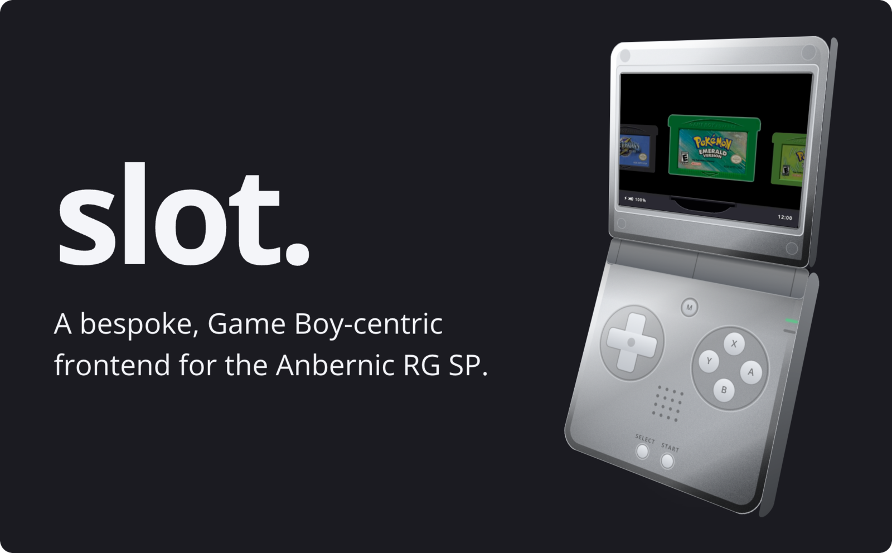
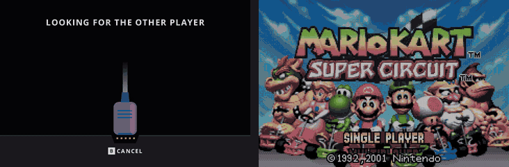

---

# What is slot?

A bespoke, Game Boy-centric frontend for the Anbernic RG SP.

Has support for GBA, GBC, and GB titles only.

> [!IMPORTANT]
> ROMs must be unzipped. slot does not read `.zip` or `.7z` files.

A full user guide can be found at [slot-cfw.fyi](https://slot-cfw.fyi).

Release notes can be found in the [changelog](CHANGELOG.md).

---

# What does it look like?

---

# Supported Devices

| Device | Supported | Since Version |
| --- | --- | --- |
| Anbernic RG SP | Yes | Always |
| Anbernic RG34XX | Untested | N/A |
| Anbernic RG34XXSP | Untested | N/A |
| Anbernic RG35XXSP | Yes | 1.5.0 |

The RG34XX will likely work from 1.4.0. The RG34XXSP may not map its sticks correctly.

If you have one of the Untested devices, or have tried slot on a device not listed, please [open an issue on GitHub](https://github.com/BrandonKowalski/slot/issues) and let me know how it went.

---

# AI Disclosure

The Rust frontend was put together by Claude Opus. I reviewed everything that was
produced. All documentation is 100% free-range, meatbag prose.

The project is extremely low stakes. I wanted a bespoke frontend for my RG SP and thought
that something that evokes the feeling of using my GBA SP as a kid would be pretty neat.

Use it, don't use it, I don't care.

Figured I should share the end result of all the wasted water. ✌🏻
